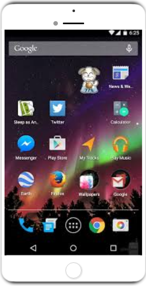

# phone-mockup-animation.github.io
A simple implementation of css3 and html5 to create a mockup animation for a mobile phone.

# MOCKUP

# HOW TO USE:
* Download / Clone this repository.
* Fork the repository before cloning (recommended).
* Open the index.html file in any browser of choice.

## CONTRIBUTING
> When you have a working local copy of the repo, make your changes, upload to your forked version and make a PR(Pull Request).
This basic application is declared open source and is intended to be well free to all user. And I encourage newbies that are new to the world of oepne source to seize this opportunity to start the journey into the world of open source and I would be more than happpy to help make the journey effortless.

## LICENSE
**UNLICENSED**

*This is to bring to the notice/awareness of the public(user) that he/she is assured equal rights to hold , manipulate, modify, copy or use a copy of this code.*

## DISCLAIMER
> I am not to be held accountable of any typos or bad practices of any sort. If you have noticed any bug in this code, reach out to me BY 
[email](mailto:aprecious000@gmail.com) or better make a PR(Pull Request) with the solution.

